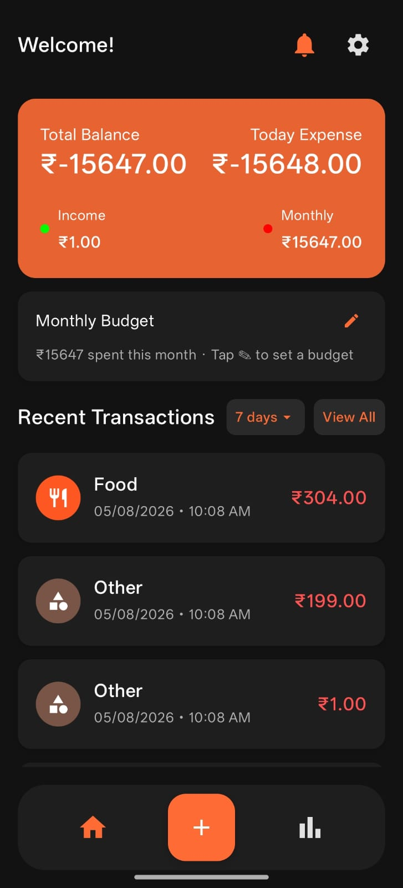
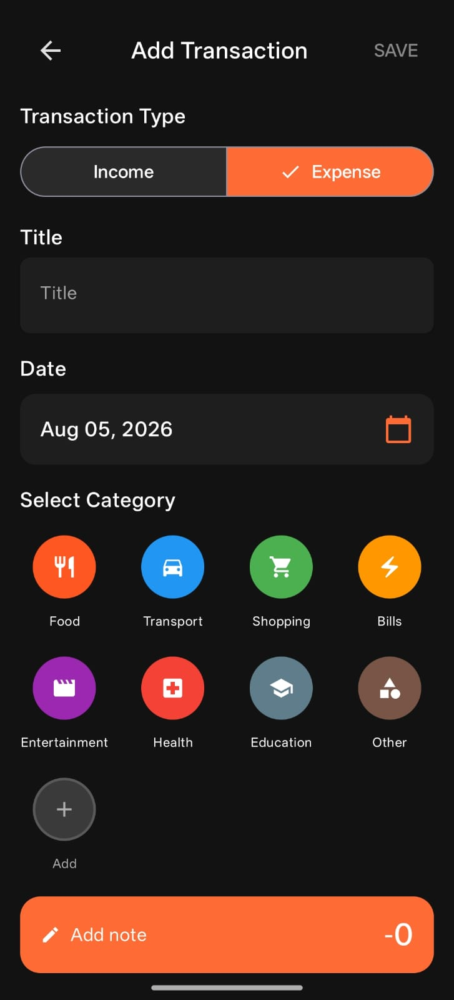
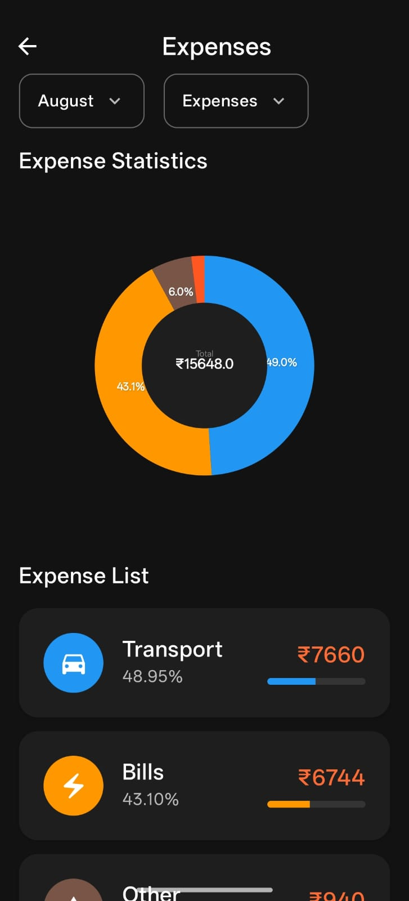
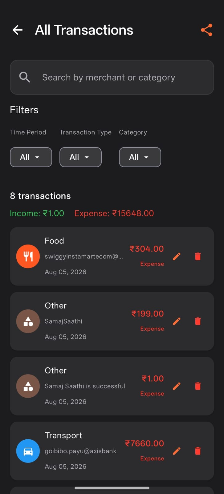
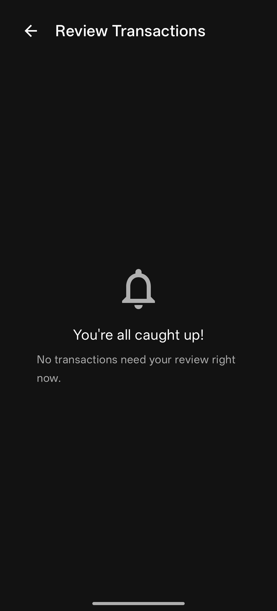
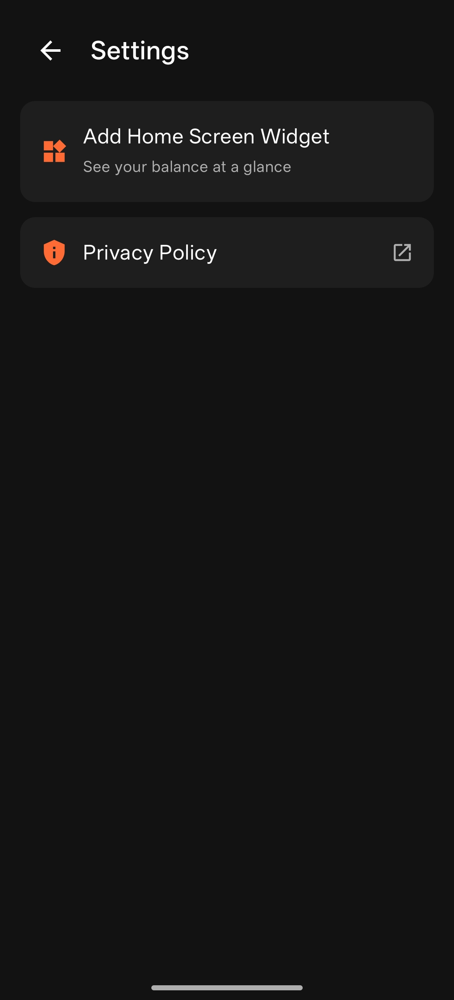

# ExpenseTracker

ExpenseTracker is an Android app that automatically tracks your spending by reading
your bank and UPI SMS alerts — no manual entry required. It detects transactions as
they happen, categorizes them, and gives you a clear dashboard and statistics of
where your money goes.

## Screenshots

| Dashboard | Add Expense | Statistics |
|---|---|---|
|  |  |  |

| All Transactions | Pending Review | Settings |
|---|---|---|
|  |  |  |

## Features

### Automatic transaction detection
- Reads incoming SMS (`RECEIVE_SMS`) and existing SMS history (`READ_SMS`) to detect
  bank and UPI transactions automatically — no manual entry needed.
- On first launch, scans the current month's SMS inbox once and feeds any matching
  transactions into the app automatically (`PastSmsScanWorker`).
- Parses bank/UPI SMS formats and merchant/VPA details (`SmsParser`, `BankSmsPattern`,
  `WalletVpaDetector`).
- Filters out non-transactional/promotional SMS (`SmsFilter`).
- Auto-categorizes transactions based on merchant, with a learning repository that
  improves categorization over time (`SmsCategorizer`, `MerchantLearningRepository`).
- Background auto-confirmation of low-ambiguity transactions via WorkManager
  (`AutoConfirmWorker`).
- A dedicated **Pending Review** screen for transactions that need manual
  category confirmation.

### Dashboard & insights
- Home dashboard with total balance, today's/monthly spend, income, and recent
  transactions at a glance.
- Set and track a monthly budget directly from the dashboard.
- Full transaction list with search (by merchant/category) and filters by time
  period, transaction type, and category, plus a share action to export the list.
- Detail view and edit/delete actions for individual transactions.
- Expense statistics screen with a category-wise donut chart and breakdown list,
  filterable by month.
- Manual "Add Expense" flow (income/expense toggle, title, date, category) for
  entries that don't come from SMS.

### Home screen widget
- Glance-based app widget showing at-a-glance expense info, deep-linking back into
  the app (`AppWidget`, `EXTRA_NAVIGATE_TO`).

### Notifications & background reliability
- Notification channel and category-confirmation notifications so you can confirm/
  correct a detected transaction's category directly from the notification shade.
- Prompts the user to disable battery optimization for the app so background SMS
  processing keeps working reliably.
- Requests `POST_NOTIFICATIONS` permission on Android 13+.

### Onboarding & permissions
- A redesigned SMS permission rationale dialog (native Compose Material 3) explains
  *why* the app needs SMS access, what it does with it, and that the current month's
  messages will be scanned and fed into the app automatically on first grant.

### UI/UX
- Fully edge-to-edge UI: content extends behind the system status bar, and the
  system navigation bar auto-hides (swipe up to reveal it temporarily), so the app's
  own bottom navigation bar sits flush against the screen edge.
- Splash screen powered by `androidx.core.splashscreen`.
- Settings screen with a link to the privacy policy.
- Light/dark theme support (Material 3).

### Data & architecture
- **UI:** Jetpack Compose + Material 3
- **DI:** Koin
- **Local storage:** Room (transactions, categories)
- **Async:** Kotlin Coroutines + WorkManager (background SMS scanning/auto-confirm)
- **Analytics/Monitoring:** Firebase Analytics, Crashlytics, Performance Monitoring
- Repository pattern (`TransactionRepository`, `CategoryRepository`,
  `MerchantLearningRepository`) between Room and the ViewModels
  (`TransactionViewmodel`, `CategoryViewModel`).

## Permissions used

| Permission | Why it's needed |
|---|---|
| `RECEIVE_SMS` / `READ_SMS` | Detect and parse bank/UPI transaction SMS automatically |
| `POST_NOTIFICATIONS` | Show category-confirmation and background-processing notifications |
| `REQUEST_IGNORE_BATTERY_OPTIMIZATIONS` | Keep background SMS processing reliable when the app is closed |
| `INTERNET` | Firebase Analytics/Crashlytics/Performance reporting |

The app is fully usable without granting SMS access — you can add and track
expenses manually instead.

## Tech stack / requirements

- Kotlin, Jetpack Compose
- Min SDK 26, Target SDK 36
- Koin for dependency injection
- Room for local persistence
- WorkManager for background SMS scanning
- Firebase (Analytics, Crashlytics, Performance)

## Getting started

1. Clone the repo and open it in Android Studio.
2. Add your own `google-services.json` under `app/` (Firebase project) if you want
   Analytics/Crashlytics/Performance to work.
3. Run the `app` module on a device or emulator (API 26+).
